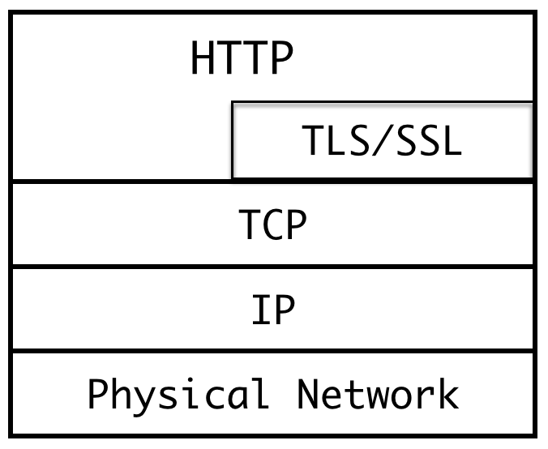

#
HTTP

HTTP是一个客户终端（用户）和服务器端（网站）请求和应答的标准。通过使用Web浏览器，网络爬虫或者其他工具，客户端发起一个HTTP请求到服务器上的指定端口（默认端口80），我们称这个客户端为用户代理程序（user agent）。应答的服务器上存储这一些资源，比如HTML文件和图像，我们称这个应答服务器为源服务器（origin server）。在用户代理和源服务器中间可能存在多个“中间层”，比如代理服务器，网关或者隧道（tunnel）。

HTTP协议中，并没有规定它支持的层。事实上，HTTP可以在任何互联网协议上，或其他网络上实现。HTTP假定其下层协议提供可靠的传输，因此，任何能够提供这种保证的协议都可以被其使用，在TCP/IP协议族使用TCP作为其传输层。

HTTP是一个应用层协议，主要用于Web开发，通常由HTTP客户端发起一个请求，创建一个到服务器指定端口（默认是80端口）的TCP连接。HTTP服务器则在那个端口监听客户端的请求。一旦收到请求，服务器会向客户端返回一个状态，比如“HTTP/1.1 200 OK”，以及返回的内容，如请求文件、错误消息、或者其它信息。

HTTP是一个无状态的协议，也就是说服务器不回去维护与客户交互的相关信息，因此它对于事务处理没有记忆能力。举个例子来讲，你通过服务器认证后成功请求了一个资源，紧接着再一次请求这一资源时，服务器仍就会要求你表明身份。

无状态不代表HTTP不能保持TCP连接，更不能代表HTTP使用的是UDP协议（无连接）。事实上HTTP正是基于TCP的协议，其在TCP/IP四层网络模型中的位置如下图所示：

