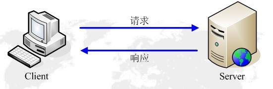

#
HTTP

HTTP是一个客户终端（用户）和服务器端（网站）请求和应答的标准。通过使用Web浏览器，网络爬虫或者其他工具，客户端发起一个HTTP请求到服务器上的指定端口（默认端口80），我们称这个客户端为用户代理程序（user agent）。应答的服务器上存储这一些资源，比如HTML文件和图像，我们称这个应答服务器为源服务器（origin server）。在用户代理和源服务器中间可能存在多个“中间层”，比如代理服务器，网关或者隧道（tunnel）。

HTTP协议中，并没有规定它支持的层。事实上，HTTP可以在任何互联网协议上，或其他网络上实现。HTTP假定其下层协议提供可靠的传输，因此，任何能够提供这种保证的协议都可以被其使用，在TCP/IP协议族使用TCP作为其传输层。

HTTP是一个应用层协议，主要用于Web开发，通常由HTTP客户端发起一个请求，创建一个到服务器指定端口（默认是80端口）的TCP连接。HTTP服务器则在那个端口监听客户端的请求。一旦收到请求，服务器会向客户端返回一个状态，比如“HTTP/1.1 200 OK”，以及返回的内容，如请求文件、错误消息、或者其它信息。

HTTP是一个无状态的协议，也就是说服务器不回去维护与客户交互的相关信息，因此它对于事务处理没有记忆能力。举个例子来讲，你通过服务器认证后成功请求了一个资源，紧接着再一次请求这一资源时，服务器仍就会要求你表明身份。

无状态不代表HTTP不能保持TCP连接，更不能代表HTTP使用的是UDP协议（无连接）。事实上HTTP正是基于TCP的协议，其在TCP/IP四层网络模型中的位置如下图所示：

#HTTP协议基础

##HTTP 请求

http请求由三部分组成，分别是：请求行、消息报头、请求正文。

###请求行

请求行的格式如下：

>Method SP Request-URI SP HTTP-Version CRLF

请求行以一个方法符号开头，后面跟着请求的URI和协议的版本，中间以空格隔开。其中：

1. Method指出在由Request-URI表实的资源上所执行的方法，方法是大小写敏感的：
2. Request-URI是一个统一资源标识符，（通过简单的格式化字符串，通过名称、位置、或其他任何特性标识某个资源）。
3. HTTP-Version表示请求的HTTP协议版本；
4. CRLF表示回车和换行（出了作为结尾的CRLF外，不允许出现单独的 CR 或 LF 字符）。

常用的请求方法如下：

<table border="2">
<tr>
  <td>** 方法名称 **</td>
  <td> 
**含义**
 </td>
</tr>   
<tr>
  <td>GET</td>
  <td>获取由Request-URI标识的任何信息（以实体的形式），如果Request-URI引用某个数据处理过程，则应该以它产生的数据作为在响应中的实体，而不是该过程的源代码文本，除非该过程碰巧输出该文本。</td>
</tr>
<tr>
  <td>POST</td>
  <td>用来请求原始服务器接收请求中封装的实体作为请求中的Request-URI标识的附属。 POST主要用于向数据处理过程提供数据块，如递交表单或者是通过追加操作来扩展数据库。</td>
</tr>
<tr>
  <td>PUT</td>
  <td>提供Request-URI存储封装的实体。</td>
</tr>
<tr>
  <td>DELETE</td>
  <td>请求原始服务器删除Request-URI标识的资源。</td>
</tr>
<tr>
  <td>HEAD</td>
  <td>除了服务器不能在响应中返回消息体，HEAD方法与GET相同。用来获取暗示实体的元信息，而不需要传输实体本身。常用于测试超文本链接的有效性、可用性和最近的修改。</td>
</tr>
</table>

例子：

<pre>
GET /index.html HTTP/1.1  
POST http://192.168.2.217:8080/index.jsp HTTP/1.1
</pre>

##消息报头

报头域是由名字+"："+空格+值 组成，消息报头域的名字是大小写无关的。请求消息报头包含了 普通报头、请求报头、实体报头。

普通报头中，有少数报头域用于所有的请求和消息响应，但并不用于被传输的实体，只是用于传输的消息。比如：

* Cache-Control：用于指定缓存指令，缓存指令是单向的（响应中出现的缓存指令在请求中未必会出现），而是独立的（一个消息的缓存指令不会影响另一个消息处理的缓存机制）;
* Data：表示消息产生的日期和时间；
* Connection：允许发送指定连接的选项，例如指定连接是连续，或者指定”close“选项，通知服务器在响应完成后关闭连接。

请求报头允许客户端向服务器端传递请求的附加信息以及客户端自身的信息。常用的请求报头入下：

* Host:指定被请求资源的Internet主机和端口号，它通常是从HTTP URL中提取出来的；
* User-Agent：允许客户端将它的操作系统、浏览器和其他属性告诉服务器；
* Accept：指定客户端接受哪些类型的信息，eg：Accept:image/gif，表明客户端希望接受GIF土小格式的资源；
* Accept-Charset：指定客户端接受的字符集，缺省是任何字符集都可以接受；
* Accept-Encoding：指定可接受的内容编码，缺省是各种内容编码都可以接受；
* Authorization：证明客户端有权查看某个资源，当浏览器访问某一个页面，如果收到服务器的响应代码为401（未授权），可以发送一个包含Authorization请求包头域的请求，要求服务器对其进行验证。

###请求正文

##HTTP 响应

在接收和解释请求消息后，服务器返回一个HTTP响应消息。HTTP响应也是由三个部分组成，分别是：状态行、消息报头、响应正文。

###状态行

所有HTTP响应的第一行都是状态行，依次是当前HTTP版本号，3位数字的状态码，以及描述状态的短语，彼此由空格分隔。

>HTTP-Version Status-Code Reason-Phrase CRLF

HTTP状态码的作用：Web服务器用来告诉客户端，发生了什么事。状态码的第一个数字代表当前响应的类型：

* 1xx消息——请求已被服务器接收，继续处理
* 2xx成功——请求已成功被服务器接收
* 3xx重定向——需要后续操作才能完成这一请求
* 4xx客户端错误——请求含有词法错误或者无法被执行
* 5xx服务器错误——服务器在处理某个正确请求时发生错误

常见的状态码有如下：

* 200 OK 服务器成功处理了请求
* 206 Partial Content（部分内容）代表服务器已经处理了部分GET请求（只有发送GET方法的request，web服务器才可能返回206）；
* 301 Moved Permanently（永久重定向）请求的URL已移走。Response中应该包含一个Location URL，说明资源现在所处的位置；
* 302 Moved Temporarily（临时重定向）；
* 304 Not Modified（为修改），客户的缓存资源是最新的，要客户端使用缓存
* 400 Bad Request（坏请求），告诉客户端，它发送了一个错误请求；
* 401 Unauthorized（未授权）需要客户端对自己认证；
* 404 Not Found 未找到资源；
* 500 Internal Server Error 服务器遇到一个错误，使其无法提供服务。

##消息报头

响应消息报头包含了普通报头、响应报头、实体报头，普通报头和实体报头和请求消息报头中的普通报头、实体报头相同。

响应报头允许服务器传递不能放在状态行中的附加响应信息，以及关于服务器的信息和对 Request-URI 所标识的资源进行下一步访问的信息。常用的响应报头如下：

* Location:用于重定向接收到一个新的位置，Location响应报头域常用在更换域名的时候；
* Server:包含了服务器用来处理请求的软件信息，与User-Agent群那个求报头域是相对应的；
* www-Authenticate：必须包含在401（未授权的）响应消息中。

##响应正文

消息正文类似HTTP请求的消息正文。

##**HTTP协议之GET与POST**

HTTP协议定义了很多与服务器交互的方法，最基本的有4种，分别是GET、POST、PUT、DELETE。一个URL地址用于描述一个网络上的资源，而HTTP中的GET、POST、PUT、DELETE就对应着查、改、增、删 四个操作。我们最常见的就POST和GET。GET一般用于**获取/查询**资源信息，而POST一般用于**更新**资源信息，主要区别入下：

1. GET提交的数据会放在URL之后，以 ？ 分割URL和传输数据，参数之间以&相连，如EditPosts.aspx?name=test1&id=123456 POST方法是把提交的数据放在HTTP包的Body中。

2. GET提交的数据大小有限制（因为 浏览器对URL的长度有限制，实际上HTTP协议规范没有对URL长度进行限制），而POST方法提交的数据没有限制。

3. GET方式需要使用Request.QueryString来取得变量的值，而POST方式通过Request.Form来获取变量的值，也就是说Get是通过地址栏来传值，而Post是通过提交表单来传值。

4. GET方式提交数据，会带来安全问题，比如一个登陆页面，通过GET方式提交数据时，用户和密码会出现在URL上，如果页面可以被缓存或者其他人可以访问这台机器，拿就可以从历史记录获得该用户的账号和密码。

##HTTP不同版本区别

HTTP/1.0版本 1.1 版本主要区别如下：

* 宽带优化

  HTTP/1.0中，存在一些浪费宽带的现象，例如客户端只是需要某个对象的一部分，而服务器却将整个对象送过来了。
  HTTP/1.1中在请求消息中引入了range头域，它允许只请求资源的某个部分

  另外一种情况是请求消息中，如果包含比较大的实体内容，但不确定服务器是否能够接收该请求（如是否有权限），此时若贸然发出带实体的请求，如果被拒绝也会浪费宽带。HTTP/1.1加入了一个新的状态码100（continue），客户端事先发送一个只带头域的请求，如果服务器因为权限拒绝了请求，就回送响应码401（unauthorized）；如果服务器接收此请求就回送响应码100，客户端就可以继续发送带实体的完整请求了。

* 长连接

  HTTP1.0规定浏览器与服务器只保持短暂的连接，浏览器的每次请求都需要与服务器建立一个TCP连接，服务器完成请求处理后立即断开TCP连接，服务器不跟踪每个客户也不记录过去的请求。由于大多数网页的流量都比较小，一次TCP连接很少能通过slow-start区，不利于提高宽带利用率。

  HTTP1.1支持长连接（PersistentConnection）和请求的流水线（Pipelinning）处理，在一个TCP连接上可以传送多个HTTP请求和响应，减少了建立和关闭连接的消耗和延迟。

  HTTP1.1还允许客户端不用等待上一次请求结果返回，就可以发出下一次请求，但服务端必须按照接收到客户端请求的先后顺序一次回送响应结果，以保证客户端能够区分出每次请求的响应内容，这样也显著地减少了整个下载过程所需的时间。

* 缓存

  在HTTP/1.0中，使用Expire头域来判断资源的fresh或stale，并使用条件请求来判断资源是否有效。例如，cache服务器通过if-Modified-Since头域向服务器验证资源的Last-Modefied头域是否有更新，源服务器可能返回304（Not Modified），则表明该对象仍有效；也可能返回200（OK）替换请求的Cache对象。
  
  HTTP/1.1在1.0的基础上加入了一些cache的新特性，当缓存对象的Age超过Expire时变为stale对象，cache不需要直接抛弃stale对象，而是与源服务器进行重新激活（revalidation）。
  
* Host头域

  在HTTP1.0中认为每台服务器都绑定一个唯一的IP地址，因此请求消息中的URL并没有传递主机名（hostname）。但随着虚拟主机技术的发展，在一台物理服务器上可以存在多个虚拟主机（Multi-homed Web Servers），并且它们共享一个IP地址。HTTP1.1请求消息和响应消息都支持Host头域，请求消息中如果没有Host头域会报告一个错误（400 Bad Request）。
  
* 错误提示

  HTTP/1.0中只定义了16和状态响应码，对错误或警告的提示不够具体。HTTP/1.1引入了一个Warning头域，增加对错误或警告信息的描述。
  
  此外，在HTTP/1.1中新增了24个状态响应码，如409（conflict）表示请求的资源与资源的当前状态发生冲突；410（Gone）表示服务器上的某个资源被永久性的删除。
  
 
 #HTTP 高级内容
 
 ##Cookie与Session
 
 Cookie与Session都为了用来保存状态信息，都是保存客户端状态的机制，它们都是为了解决HTTP无状态的问题而所做的努力。
 
 ##Cookie 机制

简单地说，cookie就是浏览器存储在用户电脑上的一小段文本文件。cookie是纯文本格式，不包含任何可执行的代码。一个Web页面或服务器告知浏览器按一定规范来存储这些信息，并在随后的请求中将这些信息发送至服务器，Web服务器就可以使用这些信息来识别不同的用户。大多数需要登陆的网站在用户验证成功后都会设置一个cookie，只要这个cookie存在，用户就可以自由浏览这个万展的任意页面。

cookie会被浏览器自动删除，通常存在以下几个原因：

  1. 回话cookie（session cookie）在回话结束时（浏览器关闭）会被删除；
  2. 持久化cookie（Persistent cookie） 在到达失效日期时会被删除；
  3. 如果浏览器中的cookie数量达到限制，那么cookie会被删除以为新建的cookie创建空间。
  
大多数浏览器支持最大为4096字节的cookie，由于这限制了cookie的大小，最好用cookie来存储少量数据，或者存储用户ID之类的标识符。用户ID随后便可用于标识用户，以及从数据库或其它数据源红读取用户信息。浏览器还限制站点可以在用户计算机上存储的cookie的数量。大多数浏览器只允许每个站点存储20个cookie；如果师徒存储更多的cookie，则最旧的cookie便会被丢弃。有些浏览器还会对它们将接收的来自所有站点的cookie总数做绝对值，通常为300个。

使用cookie缺点：
  * 不良站点用cookie搜集用户隐私信息
  * cookie窃取：黑客可以通过窃取用户的cookie来模拟用户的请求行为。（跨站脚本攻击XSS）
  
##Session 机制
  
Session机制是一种服务器端的机制，服务器使用一种类似于散列表的结构（也可能就是散列表）来保存信息。当程序需要为某个客户的请求创建一个session时候，服务器首先检查这个客户端的请求里是否已包含了一个session标识（session ID）：
  
  - 如果已包含一个session ID 则说明以前已经为次客户端创建过session，服务器就按照session ID 把这个 Session 检索出来使用（如果检索不到，就新建一个）。
  - 如果客户请求不包含 session ID，则为此客户创建一个session，并且生成一个与此session相关联的session ID，session ID的值应该是一个既不会重复，又不容易被找到规律以仿造的字符串，这个session ID将被在本次响应中返回给客户端保存。
  
的具体实现方式：
 
  - Cookie方式：服务器给每个Session分配一个唯一的JSESSIONID，并通过Cookie发送给客户端。当客户端发起新的请求的时候，将在Cookie头中携带这个JSESSIONID，这样服务器能够找到这个客户端对应的Session。
  - URL回写：服务器在发送给浏览器页面的所有链接中都携带JSESSIONID的参数，这样客户端点击任何一个链接都会把JSESSIONID带回服务器。如果直接在浏览器输入服务端资源的url来请求该资源，那么Session是匹配不到的。