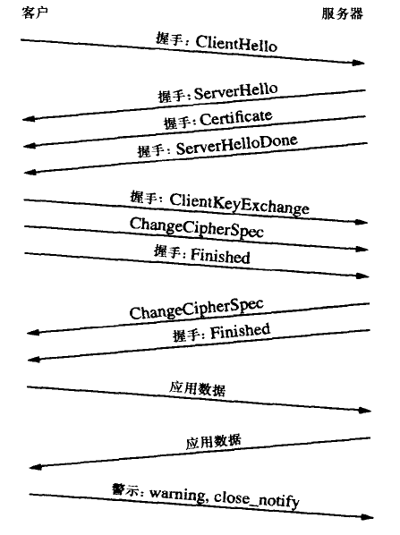

#一、SSL协议握手部分

开始加密通信之前，客户端和我服务器首先必须建立连接和交换参数，这个过程叫做握手（handshake）。

假定客户端叫爱丽丝，服务器端叫鲍勃，整个握手过程如下：

握手分为五步：

1. 爱丽丝给出协议版本号，一个客户但生成的随机数（client random），以及客户端支持的加密方法。

2. 鲍勃确认双方使用的加密方法，并给出数字证书，以及一个服务器生成的随机数（server random）。

3. 爱丽丝确认数字证书有效，然后生成一个新的随机数（premaster serect）。

4. 鲍勃使用自己的私钥，获取爱丽丝发来的随机数（permaster serect）。

5. 爱丽丝和鲍勃更具约定的加密方法，使用前面的三个随机数，生成“对话密钥”（session key），用来加密接下来的整个对话过程。

#https是建构在SSL/TLS智商的http协议，所以https比http多用多少资源主要看SSL/TLS本身小号多少服务器资源。

由上图可以看出，SSL握手需要交换9个包，也就是 TCP握手3个包 的三倍，所以https的速度大约是http的4倍。